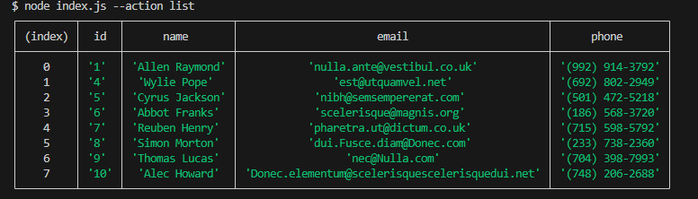
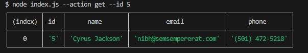
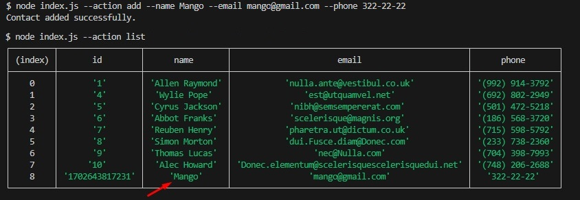
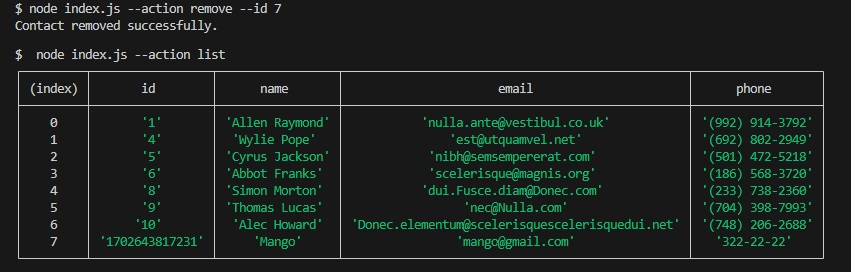
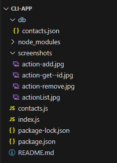

# CLI-App# CLI-App

---

A simple app to store contacts.

## Introduction

This is CLI console application. The application uses the commander module to parse command line arguments. You can add, delete, filter by id contacts and display a table with saved contacts.

### First install all required dependencies:

- npm install

### Basic comedy in the terminal

- node index.js --action list
  
- node index.js --action get --id 'enter the id you are looking for'
  
- node index.js --action add --name Mango --email mango@gmail.com --phone 322-22-22
  
- node index.js --action remove --id enter the id to be deleted
  

## Project Structure

---

## Author

---

Arleta Janysz
